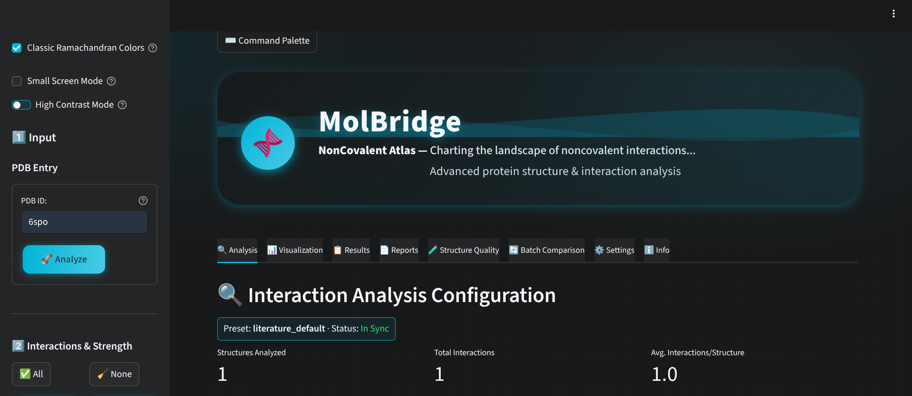
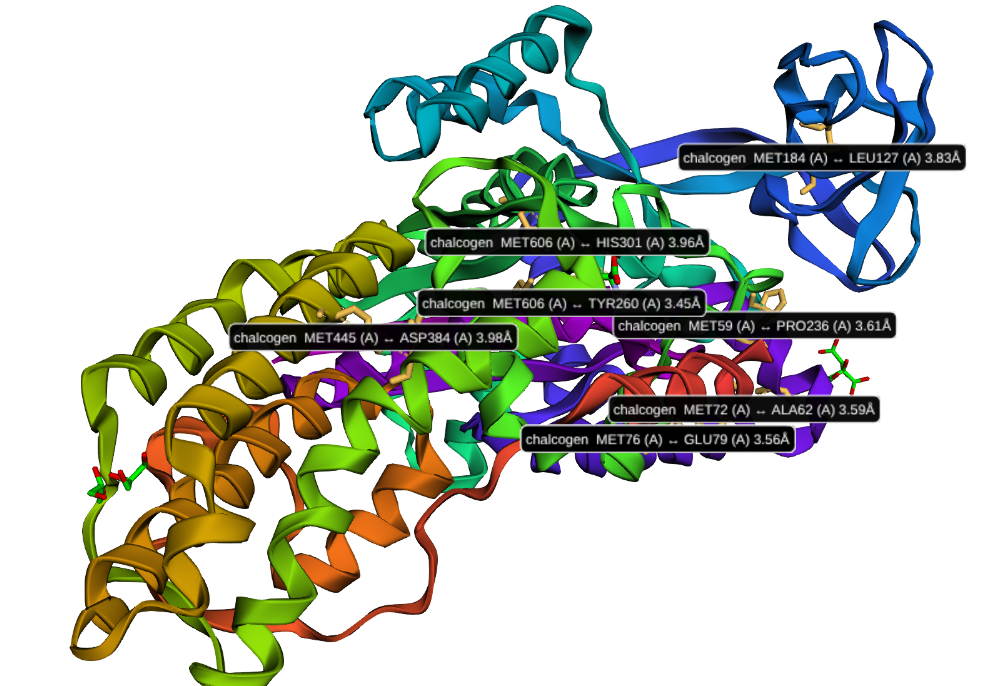
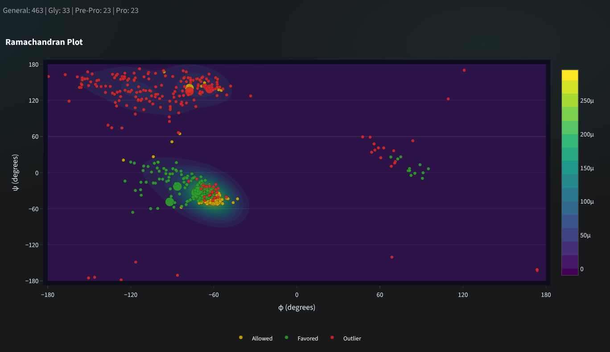
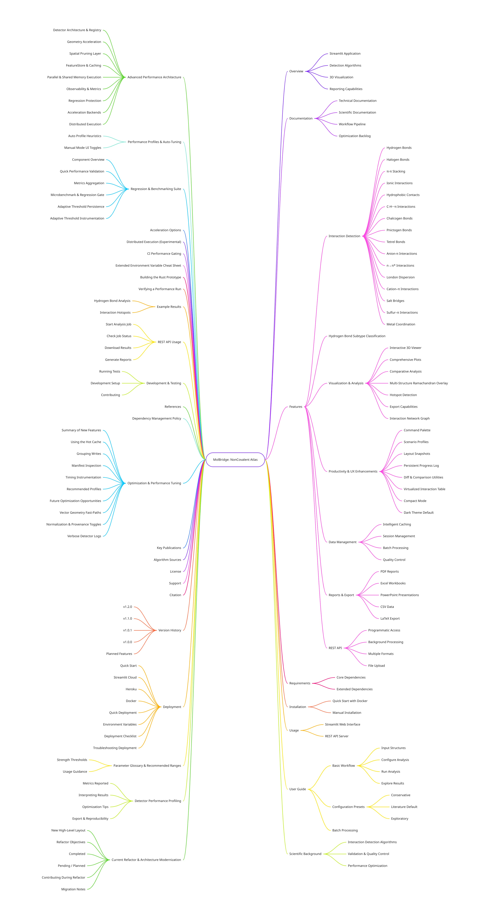

# MolBridge: NonCovalent Atlas

<p align="center">
   
</p>

A comprehensive, production-ready Streamlit application for analyzing noncovalent interactions in protein structures. MolBridge provides state-of-the-art detection algorithms for a broad and growing spectrum of molecular interactions (now 15 core interaction classes plus hydrogen bond subtype analytics), interactive 3D visualization, and extensive reporting capabilities.

## 📚 Documentation Overview
| Document | Purpose |
|----------|---------|
| [Technical Documentation](docs/TECHNICAL_DOCUMENTATION.md) | Architecture, modules, pipeline, flags, extension guidance |
| [Scientific Documentation](docs/SCIENTIFIC_DOCUMENTATION.md) | Biophysical rationale, criteria, interpretation & caveats |
| [Workflow Pipeline](docs/WORKFLOW_PIPELINE.md) | End-to-end logic blocks, data flow & Miro diagram prompt |
| [Optimization Backlog](docs/OPTIMIZATION_BACKLOG.md) | Deferred performance / refactor tasks & prioritization |

These complement the user-facing guide and serve different audiences (research, engineering, operations).

## 🚀 Features

### 📸 Visual Overview
Representative visuals (see `docs/images/`).
| Main Dashboard |
|----------------|
|  |

| Chalcogen Overlay | Ramachandran Plot |
|-------------------|------------------|
|  |  |

**Mind Map (Architecture & Feature Taxonomy)**



### Interaction Detection
- **Hydrogen Bonds**: Conventional, low-barrier, and C5-type hydrogen bonds
- **Halogen Bonds**: Cl, Br, I, and F-mediated interactions with directional sigma holes
- **π-π Stacking**: Face-to-face and edge-to-face aromatic interactions
- **Ionic Interactions**: Distance-based charge pairing (general)
- **Hydrophobic Contacts**: Van der Waals interactions between nonpolar groups
- **C-H···π Interactions**: Weak hydrogen bonds to aromatic systems
- **Chalcogen Bonds**: S, Se, Te-mediated interactions
- **Pnictogen Bonds**: N, P, As-mediated interactions
- **Tetrel Bonds**: C, Si, Ge-mediated interactions
- **Anion-π Interactions**: Negative charges interacting with π-systems
- **n→π* Interactions**: Orbital overlap interactions
- **London Dispersion**: Heuristic detection of dispersion forces
- **Cation–π Interactions**: Aromatic ring stabilization by proximal cationic side chains (ARG, LYS, protonated HIS, metal centers)
- **Salt Bridges**: Explicit detection of polar side-chain ion pairs (ARG/LYS/HIS⁺ vs ASP/GLU⁻) with atom and centroid distance heuristics
- **Sulfur–π Interactions**: Soft sulfur (CYS SG, MET SD) contacts with aromatic ring faces
- **Metal Coordination**: Inner/outer sphere coordination (primary ≤2.6 Å, extended ≤3.0 Å) to common protein-bound metals (Zn, Fe, Mg, Ca, Mn, Cu, Ni, Co, Na, K)

### Hydrogen Bond Subtype Classification (Extension)
Automated post-processing classifies each hydrogen bond into:
- Backbone–Backbone
- Backbone–Sidechain
- Sidechain–Sidechain
- Ligand (one partner non-canonical)
- Water-Mediated (HOH/WAT involvement)

Outputs counts, fractions, and an annotated list; available in the UI (Advanced Extensions) and exported (CSV + aggregate summaries). Toggle via `enable_hbond_subtypes`.

### Visualization & Analysis
- **Interactive 3D Viewer**: py3Dmol-based structure visualization with interaction overlays
- **Comprehensive Plots**: Heatmaps, distribution plots, Ramachandran plots with hotspot highlighting
- **Comparative Analysis**: Side-by-side comparison of multiple structures
- **Multi-Structure Ramachandran Overlay**: Overlay φ/ψ distributions from additional analyzed structures
- **Hotspot Detection**: Identification of interaction-rich regions
- **Export Capabilities**: PyMOL and ChimeraX session generation
- **Interaction Network Graph**: Force-directed network with edge filtering, collapsing and label toggles

### Productivity & UX Enhancements
- **Command Palette (Ctrl/Cmd+K)**: Fuzzy command search for presets, profiles, layout ops
- **Scenario Profiles**: YAML-defined templates (electrostatic focus, interface hotspots, metal site context, etc.)
- **Layout Snapshots**: Save & restore interaction selections and strength filters
- **Persistent Progress Log**: Streaming per-detector events + live status pill
- **Diff & Comparison Utilities**: Coordinate-aware hashing, filtering, CSV export
- **Virtualized Interaction Table**: AgGrid fallback for large datasets
- **Compact (Small Screen) Mode**: Manual toggle for space-constrained devices
- **Dark Theme Default**: Light mode removed for streamlined styling; high contrast & classic Ramachandran color toggles retained

### Data Management
- **Intelligent Caching**: Persistent storage with 7-day expiration
- **Session Management**: Save, load, and compare analysis sessions
- **Batch Processing**: Parallel analysis of multiple structures
- **Quality Control**: Structure validation and completeness assessment

### Reports & Export
- **PDF Reports**: Comprehensive analysis reports with figures and tables
- **Excel Workbooks**: Multi-sheet data export with summary statistics
- **PowerPoint Presentations**: Publication-ready slide decks
- **CSV Data**: Raw interaction data for further analysis
- **LaTeX Export**: Publication-ready snippets for manuscripts

### REST API
- **Programmatic Access**: Full REST API with FastAPI backend
- **Background Processing**: Asynchronous job execution with progress tracking
- **Multiple Formats**: JSON, CSV, PDF, Excel output formats
- **File Upload**: Custom structure analysis support

## 📋 Requirements

### Core Dependencies
```
streamlit>=1.28.0
biopython>=1.83
biopandas>=0.4.0
numpy>=1.24.0
scipy>=1.12.0
pandas>=2.2.0
plotly>=5.18.0
py3dmol>=2.0.4
matplotlib>=3.8.0
seaborn>=0.13.0
```

### Extended Dependencies
```
fastapi>=0.104.0
uvicorn>=0.24.0
reportlab>=4.0.0
openpyxl>=3.1.0
python-pptx>=0.6.23
diskcache>=5.6.0
scikit-learn>=1.3.0
networkx>=3.2
```

## 🛠️ Installation

### Quick Start with Docker (Recommended)
```bash
git clone https://github.com/yourusername/protein-interaction-explorer.git
cd protein-interaction-explorer
docker build -t protein-explorer .
docker run -p 8501:8501 -p 8000:8000 protein-explorer
```

### Manual Installation
```bash
git clone https://github.com/yourusername/protein-interaction-explorer.git
cd protein-interaction-explorer
pip install -r requirements.txt
```

## 🚀 Usage

### Streamlit Web Interface
```bash
streamlit run server.py
```
Access the application at `http://localhost:8501`

### REST API Server
```bash
API documentation available at `http://localhost:8000/docs`

from src.utils.config import AppConfig

```

## 📖 User Guide

### Basic Workflow

1. **Input Structures**
   - Enter PDB IDs (e.g., "1LYZ, 2LYZ, 3LYZ")
   - Upload custom PDB/CIF files
   - Paste structure data directly

2. **Configure Analysis**
   - Choose interaction types to analyze
   - Select parameter preset (Conservative/Literature Default/Exploratory)
   - Customize individual parameters if needed

3. **Run Analysis**
   - Click "Start Analysis" to begin processing
   - Monitor progress in real-time
   - Review results as they complete

4. **Explore Results**
   - **Structure Tab**: Interactive 3D visualization with interaction overlays
   - **Analysis Tab**: Detailed interaction tables and statistics
   - **Visualization Tab**: Heatmaps, distribution plots, and comparative charts
   - **Reports Tab**: Generate and download comprehensive reports

### Configuration Presets

#### Conservative
- Stricter distance and angle cutoffs
- Higher confidence interactions only
- Suitable for high-confidence structural biology

#### Literature Default (Recommended)
- Standard literature-based parameters
- Balanced sensitivity and specificity
- Most commonly used in publications

#### Exploratory
- Relaxed cutoffs for comprehensive screening
- Higher sensitivity, lower specificity
- Useful for discovering weak interactions

# Save current session
session_manager.save_session("my_analysis", {
    "pdb_ids": ["1LYZ"],
session_data = session_manager.load_session("my_analysis")
```

config.interaction_config.hbond_angle_cutoff = 25.0

# Set processing options
config.processing_config.max_workers = 8
config.processing_config.use_cache = True
```

#### Batch Processing
```python
# Process multiple structures with custom parameters
results = batch_processor.process_batch(
    pdb_ids=["1LYZ", "2LYZ", "3LYZ"],
    interaction_types=["hydrogen_bond", "pi_pi", "ionic"],
    use_cache=True,
    include_metadata=True
)
```

## 🔬 Scientific Background

### Interaction Detection Algorithms

All interaction detection algorithms implement literature-validated geometric criteria:

- **Distance cutoffs** based on sum of van der Waals radii plus tolerance
- **Angle constraints** for directional interactions (hydrogen bonds, halogen bonds)
- **Planarity requirements** for π-π stacking interactions
- **Charge-distance relationships** for ionic interactions

### Validation & Quality Control

- **Structure completeness** assessment
- **Missing atom detection** and handling
- **Coordinate validation** and outlier detection
- **Chain break identification**
- **Alternative conformer handling**

### Performance Optimization

- **KD-tree spatial indexing** for efficient neighbor searches
- **Multiprocessing** for parallel structure analysis
- **Intelligent caching** to avoid redundant calculations
- **Memory-efficient** data structures for large complexes
 - **Vector Geometry Fast-Paths** (opt-in) for hydrogen bonds & π-π stacking via `MOLBRIDGE_ENABLE_VECTOR_GEOM=1`
 - **Structure Indexing Layer** (Aromatic Ring Index) powering vector π-π detection when enabled
 - **Adaptive KD-tree Threshold Tuning** automatically relaxes/tightens distance cutoffs to balance candidate counts & speed (`utils.kdtree_thresholds`)
 - **Shared Memory Participant Distribution** for coordinates, ring centroids/normals, charged/acidic centroids, and H-bond donors/acceptors (process pool path)
 - **Process Pool High-Performance Mode** (opt-in) with fallback to threads on failure
 - **Task Graph Precompute Stage** extracts reusable features once per structure (rings, centroids, donors/acceptors) then fans out to detectors
 - **Optional Numba/Rust Kernels** accelerate pairwise distance and geometry primitives when enabled
 - **Structured JSON Metrics Stream** for per-detector timing + adaptive threshold instrumentation (consumable by `cli_metrics`)
 - **Golden Dataset Regression Framework** with curated PDB set & CI gating to prevent interaction count / performance regressions

## 🧠 Advanced Performance Architecture (Finalized Roadmap)

The original optimization roadmap is now fully implemented (historical draft superseded). A live backlog of future improvements is now maintained in `docs/OPTIMIZATION_BACKLOG.md`. Key pillars:

1. Detector Architecture & Registry
   - Unified registration decorators; stable key normalization & backward compatibility tests.
2. Geometry Acceleration
   - Vectorized distance/angle paths (π-π, cation–π, hydrophobic, hydrogen bond angular batching, chalcogen/pnictogen/tetrel multi-angle handling).
3. Spatial Pruning Layer
   - Centralized KD-tree helper + adaptive runtime threshold feedback loop recorded per detector.
4. FeatureStore & Caching
   - Ephemeral in-process feature bundles (coords, aromatic rings, charged & acidic centroids, H-bond donors/acceptors) to eliminate recomputation.
5. Parallel & Shared Memory Execution
   - Hybrid thread/process strategy; opt-in process pool uses POSIX shared memory blocks for large immutable arrays.
6. Observability & Metrics
   - Streaming JSON logs: `detector_complete`, `batch_complete`, and batch metrics channel; CLI summarization with per-detector mean & p95.
7. Regression Protection
   - Golden snapshot builder & comparator; CI artifact reuse + strict gating on interaction count & timing drift.
8. Acceleration Backends
   - Optional Numba kernel path (`MOLBRIDGE_USE_NUMBA=1`) and PyO3 Rust prototype (`rust/` + maturin) with graceful fallback.
9. Distributed Execution (Experimental)
   - Scaffold for Ray / Dask powered multi-node execution (extensible from the unified processor facade).

## 🗂 Performance Profiles & Auto-Tuning

MolBridge now ships with selectable performance profiles plus a heuristic auto-tuner:

| Profile | Intent | Enabled Features | When to Use |
|---------|--------|------------------|-------------|
| auto (default) | Smart heuristic per structure | Vector geometry, task graph always; process pool + SHM & Numba only on large workloads | General usage / mixed batch sizes |
| full | Max acceleration | Vector geometry, task graph, process pool, SHM, Numba (or Rust), adaptive thresholds | Large multi-structure batch on a beefy machine |
| minimal | Low overhead | Vector geometry + task graph only | Small single-structure interactive runs or CI |
| manual | User control | Whatever you toggle in Settings | Benchmarking / A/B comparisons |

Set via UI Settings tab (⚙️) or environment variable `MOLBRIDGE_PERF_PROFILE`.

### Auto Profile Heuristics
The `auto` mode inspects atom count, detector count, and estimated work (atoms × detectors):
* Enables process pool + shared memory if structure is large ( > ~12k atoms & ≥6 detectors) or overall estimated work is very large.
* Enables Numba only if Rust extension is unavailable and workload passes a moderate threshold.
* Always enables vector geometry + task graph (negligible overhead, consistent speedup).
* Respects any explicit user/exported env overrides (treats them as manual for that variable).

Instrumentation of the applied decision is emitted as a JSON log event `auto_perf_profile` with fields `profile`, `mode`, `n_atoms`, `n_detectors`, and which toggles were activated.

### Manual Mode UI Toggles
In manual profile you can explicitly toggle:
* Vector Geometry Fast Paths
* Process Pool Execution
* Shared Memory Transport
* Numba JIT Acceleration
* Task Graph Precompute
* Prefer Rust Geometry Extension
* Emit Adaptive Threshold Instrumentation

Changing toggles writes the corresponding environment variables and requires a re-run / new analysis batch to take effect.

## 🧪 Regression & Benchmarking Suite

| Component | CLI / Module | Purpose |
|-----------|--------------|---------|
| Golden Snapshot Builder | `cli_golden snapshot` | Produce canonical JSON baseline for curated PDB list |
| Golden Comparator | `cli_golden compare` | Detect interaction count or timing drift vs baseline |
| Performance Gate Script | `scripts/perf_regression_check.py` | Enforced in CI (non-zero exit on regression) |
| Metrics Aggregator | `cli_metrics summarize` | Mean & p95 batch + per-detector timing & adaptive stats |
| CSV Export | `cli_metrics export-csv` | Flat event log for external BI tools |
| Microbenchmark Harness | `python -m performance.microbench` | Rapid p95 timing + acceptance + funnel + memory delta scan (synthetic or real structures) |
| Microbench Regression Gate | `python -m performance.bench_regression_gate` | Compares microbench JSON vs baseline (p95 slowdown, acceptance anomalies) |
| Microbench Baseline Refresh | `python scripts/update_microbench_baseline.py` | Intentionally regenerate committed baseline with metadata (seed, repeat, timestamp) |

### Quick Performance Validation (TL;DR)
1. Golden counts/timing check (curated real PDBs):
```bash
python scripts/perf_regression_check.py --baseline golden_baseline --pdb 1CRN 4HHB 2VXN --time-tolerance 0.35
```bash
python -m performance.microbench > bench_run.json
# Optional regression gate vs existing baseline
python -m performance.bench_regression_gate bench_run.json \
   --baseline microbench_baseline.json \
   --max-p95-growth 1.30 --strict-accept

# Refresh (intentional) baseline after an accepted optimization
python scripts/update_microbench_baseline.py --seed 42 --repeat 2
```

Environment variables:
| Variable | Purpose |
|----------|---------|
| `MOLBRIDGE_BENCH_PDB_SMALL` | Path to a real small PDB (fallback: synthetic) |
| `MOLBRIDGE_BENCH_PDB_MEDIUM` | Path to a medium structure |
| `MOLBRIDGE_BENCH_PDB_LARGE` | Path to a large structure |
| `MOLBRIDGE_BENCH_REPEAT` | Repetitions per size tier (default 2) |
| `MOLBRIDGE_BENCH_SEED` | Deterministic seed for synthetic coordinate generation |
| `MOLBRIDGE_OTEL_EXPORT` | If 1, emit a lightweight OpenTelemetry stub event (placeholder for future exporter) |
python -m cli_golden snapshot --output golden_baseline.json --list-file docs/curated_golden_list.txt

# Compare current code against saved baseline
python -m cli_golden compare --baseline golden_baseline.json --list-file docs/curated_golden_list.txt
```

### Metrics Aggregation
During runs (with metrics emission enabled) a `metrics.jsonl` file accumulates structured events:
```bash
python -m cli_metrics summarize --file metrics.jsonl --out metrics_summary.json
python -m cli_metrics export-csv --file metrics.jsonl --out metrics_summary.csv
```
Summary includes:
* `batch_duration_mean`, `batch_duration_p95`
* `detector_timing_mean` + `detector_timing_p95`
* Adaptive threshold rollups: original vs adapted means & p95
* Funnel metrics: `raw_pairs`, `candidate_pairs`, `accepted_pairs`, `acceptance_ratio`, `candidate_density`

### Microbenchmark & Regression Gate

The lightweight microbenchmark harness exercises a representative subset of detectors across small/medium/large synthetic (or provided) structures:

```bash
python -m performance.microbench > bench_run.json
# Optionally compare against a saved baseline
python -m performance.bench_regression_gate bench_run.json --baseline previous_bench.json --max-p95-growth 1.30 --strict-accept
```

Environment variables:
| Variable | Purpose |
|----------|---------|
| `MOLBRIDGE_BENCH_PDB_SMALL` | Path to a real small PDB (fallback: synthetic) |
| `MOLBRIDGE_BENCH_PDB_MEDIUM` | Path to a medium structure |
| `MOLBRIDGE_BENCH_PDB_LARGE` | Path to a large structure |
| `MOLBRIDGE_BENCH_REPEAT` | Repetitions per size tier (default 2) |

Gate script flags:
| Flag | Meaning |
|------|---------|
| `--max-p95-growth` | Allowed slowdown factor vs baseline p95 |
| `--min-accept-ratio` | Warn/fail (with `--strict-accept`) if mean acceptance ratio below threshold |
| `--strict-accept` | Escalate acceptance warnings to failures |

The microbench JSON embeds per-detector warnings (`high_accept_ratio`, `near_zero_accept_ratio`) that surface in the gate output.

See also Quick Performance Validation for a condensed workflow.

### Adaptive Threshold Persistence

Adaptive KD-tree thresholds now optionally persist across runs when you set:

```bash
export MOLBRIDGE_ADAPTIVE_CACHE_PATH=.cache/adaptive_thresholds.json
```

On each adaptation, the new thresholds are flushed to this JSON file. Subsequent executions load them automatically, ensuring stability in iterative benchmark sessions and CI jobs.

Each detector's instrumentation exports:
| Field | Description |
|-------|-------------|
| `original_threshold` | Threshold when detector started |
| `adaptive_threshold` | Possibly updated threshold after feedback |
| `threshold_changed` | Boolean flag |
| `adapt_reason` | One of `raise_low_util`, `lower_high_miss`, `density_adjust_up/down`, `unchanged` |
| `last_density` | Observed candidate density used for density-based adjustments |
| `kdtree_used` | Heuristic utilization flag (pruning effectiveness) |
| `raw_pairs` | Pre-filter (broad distance) raw pair count |
| `candidate_pairs` | Post KD-tree / geometry pruning but pre-final acceptance count |
| `accepted_pairs` | Final interaction count after all geometry/class tests |
| `acceptance_ratio` | accepted_pairs / candidate_pairs (0 if denom=0) |

Heuristic pruning detection leverages a shared function (`should_flag_kdtree`) comparing candidate/raw ratios against a density target band; a dedicated test (`test_should_flag_kdtree.py`) guards its boundary behavior.

### Adaptive Threshold Instrumentation
Each detector optionally records: `original_threshold`, `adapted_threshold`, candidate counts, and adaptation decision flags. These surface in metrics summaries for longitudinal tuning.

## ⚡ Acceleration Options

| Technique | Enable | Notes |
|-----------|--------|-------|
| Vector Geometry | `MOLBRIDGE_ENABLE_VECTOR_GEOM=1` | Fast batched distance/angle math (NumPy) |
| Numba Kernel | `MOLBRIDGE_USE_NUMBA=1` | JIT fallback for distance ops when Rust off |
| Rust Geometry Prototype | Install `dev-rust` extra + `maturin develop -m rust/Cargo.toml` | Provides PyO3 `pairwise_sq_dists` |
| Process Pool + SHM | `MOLBRIDGE_USE_PROCESS_POOL=1 MOLBRIDGE_USE_SHM=1` | Shared memory for coords/rings/centroids/HB donors/acceptors |
| Task Graph Precompute | `MOLBRIDGE_TASK_GRAPH=1` (default) | Early feature extraction reused across detectors |
| Auto System Tuning | `MOLBRIDGE_AUTO_TUNE=1` (default) | Applies GC + thread env heuristics on import |

Fallback order for geometry kernels: Rust > Numba > Pure Python (NumPy). All feature flags are fail-safe (silent fallback on error; logged at debug level).

## 🌐 Distributed Execution (Experimental)
The unified processor facade includes a scaffold for Ray/Dask extension. To experiment:
1. Install your preferred framework (e.g., `pip install ray[default]`).
2. Wrap structure batches through the `DistributedProcessor` (see forthcoming docs) which mirrors the HighPerformanceProcessor interface.
3. Disable process pool locally (`MOLBRIDGE_USE_PROCESS_POOL=0`) to avoid contention and let the distributed backend manage resources.

This layer remains opt-in and is isolated so local single-node performance stays lean.

## 🔐 CI Performance Gating
The GitHub Actions workflow now additionally enforces software supply & container integrity:
1. Generates or downloads a golden baseline artifact.
2. Runs the regression check script; any interaction count deviation beyond 5% or timing slowdown beyond configured tolerance (currently 35%) fails the job.
3. Executes microbenchmark + regression gate (p95 + funnel sanity) against committed `microbench_baseline.json`.
4. Performs a security scan (`pip-audit`) for published CVEs (fails on vulnerable pinned versions).
5. Performs a Docker build smoke test to ensure container image viability.
6. Uploads metrics summaries for offline inspection.

To adjust gating thresholds edit `scripts/perf_regression_check.py` parameters or workflow step arguments.

## 🌍 Extended Environment Variable Cheat Sheet

| Variable | Purpose | Default |
|----------|---------|---------|
| `MOLBRIDGE_USE_PROCESS_POOL` | Enable process pool execution path | 0 |
| `MOLBRIDGE_USE_SHM` | Use POSIX shared memory for large feature arrays | 0 |
| `MOLBRIDGE_TASK_GRAPH` | Enable task graph precompute (feature extraction) | 1 |
| `MOLBRIDGE_USE_NUMBA` | Turn on Numba accelerated kernels | 0 |
| `MOLBRIDGE_AUTO_TUNE` | Apply system tuning at import | 1 |
| `MOLBRIDGE_USE_RUST` | Prefer Rust geometry extension if built | 1 (auto-detect) |
| `MOLBRIDGE_MAX_WORKERS` | Override worker pool size | heuristic |
| `MOLBRIDGE_ENABLE_VECTOR_GEOM` | Vector geometry fast paths | 0 |
| `MOLBRIDGE_ADAPTIVE_CACHE_PATH` | JSON file path for adaptive KD-tree threshold persistence | unset (disabled) |
| `MOLBRIDGE_BENCH_SEED` | Deterministic seed for microbenchmark synthetic structures | unset |
| `MOLBRIDGE_OTEL_EXPORT` | Emit OpenTelemetry stub line during microbench (future real exporter hook) | 0 |
| `MOLBRIDGE_USE_PROCESS_POOL` | Process (vs thread) strategy | 0 |
| `MOLBRIDGE_USE_SHM` | Shared memory transport | 0 |
| `MOLBRIDGE_ENABLE_NORMALIZATION` | Emit normalized records | 0 |
| `MOLBRIDGE_ENABLE_PROVENANCE` | Include provenance data | 0 |
| `MOLBRIDGE_PERF_PROFILE` | Performance profile selection (auto/full/minimal/manual) | auto |

Note: Duplicate lines for emphasis above are intentional groupings (strategy vs geometry); future consolidation may de-duplicate in docs.

## 🛠 Building the Rust Prototype
```bash
pip install .[dev-rust]
maturin develop -m rust/Cargo.toml  # builds in-place (debug)
# or
maturin build --release -m rust/Cargo.toml
```
Set `MOLBRIDGE_USE_RUST=0` to force fallback for A/B comparisons.

## 📈 Verifying a Performance Run
```bash
MOLBRIDGE_ENABLE_VECTOR_GEOM=1 MOLBRIDGE_USE_PROCESS_POOL=1 MOLBRIDGE_USE_SHM=1 \
python -m cli_golden compare --baseline golden_baseline.json --list-file docs/curated_golden_list.txt
python -m cli_metrics summarize --file metrics.jsonl --out metrics_summary.json
```
Inspect `metrics_summary.json` for detector `*_p95` outliers; adapt thresholds or investigate regressions as needed.

## 📊 Example Results

### Hydrogen Bond Analysis
```
Structure: 1LYZ (Lysozyme)
Total hydrogen bonds: 89
Average distance: 2.85 ± 0.23 Å
Average angle: 162.3 ± 12.7°
Strength distribution:
  Strong: 45 bonds (50.6%)
  Moderate: 32 bonds (36.0%)
  Weak: 12 bonds (13.5%)
```

### Interaction Hotspots
Top interaction hotspots:
1. ASP52A - 12 interactions (4 HB, 3 ionic, 5 others)
2. GLU35A - 9 interactions (3 HB, 2 ionic, 4 others)
3. TRP62A - 8 interactions (2 HB, 4 π-π, 2 others)
```

## 🌐 REST API Usage

### Start Analysis Job
```bash
curl -X POST "http://localhost:8000/analyze" 
     -H "Content-Type: application/json" 
     -d '{
       "pdb_ids": ["1LYZ", "2LYZ"],
       "interaction_types": ["hydrogen_bond", "pi_pi"],
       "config_preset": "literature_default"
     }'
```

### Check Job Status
```bash
curl "http://localhost:8000/jobs/{job_id}"
```
### Download Results
```bash
curl "http://localhost:8000/results/{job_id}" > results.json
```

### Generate Reports
```bash
curl -X POST "http://localhost:8000/reports" 
     -H "Content-Type: application/json" 
     -d '{
       "pdb_ids": ["1LYZ"],
       "format": "pdf",
       "include_methodology": true
     }' 
     --output report.pdf
```

## 🧪 Development & Testing

### Running Tests
```bash
python -m pytest tests/ -v
```

### Development Setup
```bash
pip install -r requirements-dev.txt
pre-commit install
```

### Contributing
1. Fork the repository
2. Create a feature branch (`git checkout -b feature/amazing-feature`)
3. Commit your changes (`git commit -m 'Add amazing feature'`)
4. Push to the branch (`git push origin feature/amazing-feature`)
5. Open a Pull Request

## 📚 References

## 📦 Dependency Management Policy

MolBridge now uses a **single authoritative** `requirements.txt` for all runtime dependencies. Previous duplicates (`requirements-prod.txt`) were removed to eliminate drift.

Guidelines:
1. Add new runtime libraries only to `requirements.txt`.
2. Mark optional/large or rarely used packages with an inline `# OPTIONAL` comment.
3. For strictly development-only tools (linters, formatters), prefer a separate (uncommitted) local dev file or use editable installs; we intentionally keep the public surface minimal.
4. To produce a frozen snapshot for reproducible deployment:
   ```bash
   pip install -r requirements.txt
   pip freeze --exclude-editable > requirements.lock
   ```
5. `pyproject.toml` retains minimal metadata and a *subset* of dependencies for packaging; the canonical list lives in `requirements.txt` to align with Streamlit/Heroku style deployments.

Removed during consolidation:
- `requirements-prod.txt` (was redundant; differences were only commented optional packages)
- Duplicate virtual environment directory `venv/` (keep `.venv/` only). If `venv/` still exists locally you can safely delete it:
   ```bash
   rm -rf venv
   ```

### Repository Hygiene (Recent Cleanup)
Obsolete or experimental artifacts were removed to reduce noise:
- `chalcogen_debug.log` (large runtime log; sampled data retained under `docs/logs/`)
- `dropdown_fix.css` (superseded by modular styles in `app/assets/styles/`)
- `temp_viewer_method.py`, `simple_viewer_test.py` (prototype scripts)
- `test_pdb_data.py`, `test_single_interaction.py` (replaced by structured tests under `src/tests/`)
- `=5.9.5` (stray editor/version artifact)

If you still have these locally, remove them or reset your working copy to match `main`.

If you do not need AI or LaTeX features, comment out the corresponding lines in `requirements.txt` before deployment for faster install.


## ⚙️ Optimization & Performance Tuning

Recent optimization work introduced configurable layers to balance speed, memory, and observability. Below is a concise guide to the new levers you can tune in different deployment scenarios (local exploration vs. batch server vs. constrained cloud).

### Summary of New Features
| Feature | Module | Purpose | Default |
|---------|--------|---------|---------|
| In-memory LRU Hot Cache | `utils.cache.CacheManager` | Avoid disk (de)serialization for most recently accessed analysis / metadata objects | 32 entries (set via env) |
| Batch Write Context | `CacheManager.batch()` | Coalesce multiple cache writes to reduce filesystem & metadata overhead | Off (opt-in) |
| Lazy Decompression | `CacheManager.get_*` | Only decompress & unpickle when accessed; preserves I/O for cold entries | Enabled automatically |
| Streaming Manifest Export | `CacheManager.export_cache_manifest` | Low-cost inspection of cache contents with heuristic sizing & filtering | Manual call |
| Timing Utilities | `performance.timing` | Lightweight decorator/context manager to aggregate wall time & throughput metrics | Enabled (can disable) |

### Environment Variables
| Variable | Effect | Example |
|----------|-------|---------|
| `MOLBRIDGE_CACHE_HOT_SIZE` | Overrides hot LRU cache capacity (0 disables) | `MOLBRIDGE_CACHE_HOT_SIZE=64` |
| `MOLBRIDGE_MANIFEST_LIMIT` | Caps number of entries returned by manifest export | `MOLBRIDGE_MANIFEST_LIMIT=500` |
| `MOLBRIDGE_ENABLE_TIMING` | Disable (0) or enable (1) global timing instrumentation | `MOLBRIDGE_ENABLE_TIMING=0` |
| `MOLBRIDGE_MAX_WORKERS` | Force worker thread count in high-performance processors | `MOLBRIDGE_MAX_WORKERS=12` |
| `MOLBRIDGE_ENABLE_VECTOR_GEOM` | Enable vectorized geometry paths (H-bonds, π-π) | `MOLBRIDGE_ENABLE_VECTOR_GEOM=1` |
| `MOLBRIDGE_ENABLE_NORMALIZATION` | Emit unified normalized interaction records | `MOLBRIDGE_ENABLE_NORMALIZATION=1` |
| `MOLBRIDGE_ENABLE_PROVENANCE` | Include provenance hashing/metadata in outputs | `MOLBRIDGE_ENABLE_PROVENANCE=1` |
| `MOLBRIDGE_ENABLE_UNIFIED_PROCESSOR` | Route through unified batch processor prototype | `MOLBRIDGE_ENABLE_UNIFIED_PROCESSOR=1` |

### Using the Hot Cache
```python
from utils.cache import CacheManager
cm = CacheManager(cache_dir=Path('cache'), hot_cache_size=64)  # or via env MOLBRIDGE_CACHE_HOT_SIZE
result = cm.get_or_compute_analysis(pdb_id, 'hydrogenbond', params, compute_fn)
```
The first access populates disk + hot cache; subsequent lookups stay in-memory until evicted (LRU discipline).

### Grouping Writes
```python
with cm.batch():
   for job in jobs:
      cm.cache_analysis_result(job.pdb, job.type, job.params, job.result)
```
Writes are deferred until the context exits, reducing disk metadata churn especially on networked or slow storage.

### Manifest Inspection
```python
manifest = cm.export_cache_manifest(limit=100, pattern='analysis_')
for entry in manifest['entries']:
   print(entry['key'], entry['size_bytes'])
```
Heuristic sizing avoids full pickling for large objects and supports prefix filtering.

### Timing Instrumentation
```python
from performance.timing import time_function, time_block, TIMINGS

@time_function(items_attr='count')
def detect(example):
   # ... run detection producing object with .count
   return example

with time_block('post_processing'):
   refine(result)

print(TIMINGS.snapshot())
```
Disable globally with `MOLBRIDGE_ENABLE_TIMING=0` (e.g., minimal overhead CI runs).

### Recommended Profiles
| Scenario | Suggested Settings |
|----------|-------------------|
| Local exploratory analysis | `MOLBRIDGE_CACHE_HOT_SIZE=64`, leave timing on |
| High-throughput batch server | `MOLBRIDGE_CACHE_HOT_SIZE=128`, `MOLBRIDGE_MANIFEST_LIMIT=300`, enable batch writes |
| Memory constrained (small container) | `MOLBRIDGE_CACHE_HOT_SIZE=8`, `MOLBRIDGE_ENABLE_TIMING=0` |
| Debug / observability focus | Increase hot size, keep timing on, export manifest periodically |

### Future Optimization Opportunities
Planned (not yet implemented) enhancements include: adaptive eviction based on object size, async compression pipeline, broadened vectorization (cation–π, CH–π, hydrophobic), cache key schema versioning, and structured metrics export (OpenTelemetry-compatible).

Recently completed (since v1.0.1 docs initial draft):
* Unified funnel metrics across all detectors (raw→candidate→accepted stages)
* Adaptive threshold extension to chalcogen & tetrel interactions
* Microbenchmark harness + regression gate CLI for rapid performance drift detection
* Persistent adaptive threshold cache (opt-in)
* Heuristic pruning utilization unification (`should_flag_kdtree`)
* Dependency lock file (`requirements.lock`) for reproducible installations

### Vector Geometry Fast-Paths (Experimental)
Set `MOLBRIDGE_ENABLE_VECTOR_GEOM=1` to activate:
* Hydrogen bond vector candidate filtering (distance matrix prefilter vs nested loops)
* π-π stacking vector detection using a pre-built `AromaticRingIndex` (centers & normals in matrices)

If disabled (default), legacy logic is used verbatim for full parity. A parity test (`test_pipi_vector_parity.py`) ensures consistency between paths for representative aromatic stacking geometry.

### Normalization & Provenance Toggles
To enable unified normalized records and provenance hashing outside of performance profiles (manual control):
```bash
export MOLBRIDGE_ENABLE_NORMALIZATION=1
export MOLBRIDGE_ENABLE_PROVENANCE=1
```
These currently lack explicit UI checkboxes (pending minor UI enhancement); toggle via environment variables before launching the app.

### Verbose Detector Logs
In performance mode non-critical detector info logs are suppressed. Force them on:
```bash
export MOLBRIDGE_VERBOSE_DETECTOR_LOGS=1
```
Use sparingly—adds overhead in large batches.


### Key Publications
1. Jeffrey, G.A. (1997). "An Introduction to Hydrogen Bonding"
2. Desiraju, G.R. et al. (2013). "Definition of the halogen bond" Pure Appl. Chem. 85, 1711-1713
3. McGaughey, G.B. et al. (1998). "π-Stacking interactions" J. Biol. Chem. 273, 15458-15463
4. Kumar, S. & Nussinov, R. (2002). "Close-range electrostatic interactions in proteins" ChemBioChem 3, 604-617

### Algorithm Sources
- Hydrogen bonds: Baker & Hubbard (1984) criteria with modern extensions
- Halogen bonds: Auffinger et al. (2004) geometric definitions
- π-π stacking: Janiak (2000) classification system
- Ionic interactions: Barlow & Thornton (1983) distance criteria

## 📄 License

This project is licensed under the MIT License - see the [LICENSE](LICENSE) file for details.

## 🤝 Support

- **Documentation**: [User Guide](docs/user_guide.md) | [API Reference](docs/api_reference.md)
- **Examples**: [Jupyter Notebooks](examples/) | [Example Scripts](examples/scripts/)
- **Issues**: [GitHub Issues](https://github.com/yourusername/protein-interaction-explorer/issues)
- **Discussions**: [GitHub Discussions](https://github.com/yourusername/protein-interaction-explorer/discussions)

## 🏆 Citation

If you use MolBridge in your research, please cite:

```bibtex
@software{molbridge,
   title={MolBridge: NonCovalent Atlas for Comprehensive Analysis of Noncovalent Interactions in Protein Structures},
  author={Your Name},
  year={2024},
   url={https://github.com/yourusername/protein-interaction-explorer}
}
```

## 🔄 Version History

### v1.2.0 (Current / Main)
User Experience, Overlay & Productivity Expansion
- Command Palette (Ctrl/Cmd+K) with fuzzy search (rapidfuzz) for presets, profiles, layout snapshot ops, and UI toggles.
- Scenario Profiles (`templates/scenario_profiles.yaml`) providing task-focused interaction sets & linked parameter presets.
- Layout Snapshot save / restore UI (sidebar) + palette actions for fast environment switching.
- Multi-Structure Ramachandran overlay with structure provenance in hover tooltips & stratified performance safeguards.
- Interaction Network enhancements: edge filtering (min edge count), collapse by interaction type, label visibility toggle, aggregated edge stats.
- Diff improvements: coordinate-aware hashing, filtering, diff summary counters, CSV export.
- Persistent detector progress stream with live status pill & timestamped events (rotating log).
- Progressive Ramachandran density rendering (auto-disable on large residue sets) + high-contrast density colorbar toggle.
- Virtualized interaction table (AgGrid fallback) for large interaction lists.
- Parameter modified indicators + one-click revert-to-preset; autosave of session metadata.
- Unified dark theme only (light mode removed) plus high-contrast & classic Ramachandran color toggles.

### v1.1.0 (Current)
Performance & Observability Expansion
- Unified funnel metrics across all detectors (`raw_pairs`, `candidate_pairs`, `accepted_pairs`, acceptance ratios) surfaced in metrics & microbench aggregates.
- Adaptive KD-tree threshold persistence (opt-in via `MOLBRIDGE_ADAPTIVE_CACHE_PATH`).
- Microbenchmark harness enhancements: memory RSS delta per run (`rss_delta_bytes`), funnel aggregation totals (`total_raw_pairs`, `total_candidate_pairs`, `total_accepted_pairs`), per-detector warnings, deterministic seeding (`MOLBRIDGE_BENCH_SEED`).
- Baseline management script `scripts/update_microbench_baseline.py` (adds `baseline_meta`: seed/repeat/timestamp) to avoid silent drift.
- OpenTelemetry export stub (`MOLBRIDGE_OTEL_EXPORT=1`) placeholder for future structured tracing.
- CI hardening: security vulnerability scan (`pip-audit`), Docker build smoke test, microbench regression gate integration.
- Documentation updates & MIT headers added to performance / regression scripts.
- Minor detector robustness: fixed anion–π detector attribute alias for synthetic benchmark safety.

### v1.0.1
- Added new detectors: Cation–π, Salt Bridges (explicit), Sulfur–π, Metal Coordination
- Hydrogen Bond Subtype extension (classification + export aggregation)
- Added explicit configurable cutoffs:
   - `cation_pi_distance_cutoff`
   - `salt_bridge_distance_cutoff`, `salt_bridge_centroid_cutoff`
   - `sulfur_pi_distance_cutoff`, `sulfur_pi_max_perp`
   - `metal_coordination_primary_cutoff`, `metal_coordination_extended_cutoff`
- Feature toggle: `enable_hbond_subtypes`
- Extended reporting & exports for new analytics

### v1.0.0
- Initial release with 11 interaction types, Streamlit interface, REST API, reporting system, 3D visualization, batch processing capabilities

### Planned Features (v1.2.0)
- Machine learning-based interaction prediction
- Enhanced visualization options
- Additional export formats
- Distributed execution maturation (Ray/Dask) beyond scaffold
- Extended API endpoints

## 🚀 Deployment

### Quick Start
Your application now includes built-in deployment options! Access the **Settings** tab in your Streamlit app for deployment guides and configuration.

### Option 1: Streamlit Cloud (Recommended - Free & Easy)
1. **Push to GitHub**: Make sure your repository is public
2. **Deploy**: Go to [share.streamlit.io](https://share.streamlit.io)
3. **Connect**: Link your GitHub account and select this repository
4. **Configure**: Set main file path to `server.py`
5. **Launch**: Click "Deploy" - your app will be live instantly!

**Your app URL**: `https://your-app-name.streamlit.app`

**Note**: The project now uses a single authoritative `requirements.txt`. (Previous split `requirements-prod.txt` was removed to prevent drift.) Streamlit Cloud and other platforms will install directly from it; comment out optional heavy deps if you need a slimmer build.

### Option 2: Heroku (Professional Hosting)
1. **Install Heroku CLI**:
   ```bash
   curl https://cli-assets.heroku.com/install.sh | sh
   ```

2. **Deploy**:
   ```bash
   heroku create your-protein-app
   git push heroku main
   ```

3. **Access**: Your app will be at `https://your-protein-app.herokuapp.com`

### Option 3: Docker (Full Control)
1. **Build the container**:
   ```bash
   docker build -t protein-interaction-app .
   ```

2. **Run locally**:
   ```bash
   docker run -p 8501:8501 protein-interaction-app
   ```

3. **Deploy to cloud platforms**:
   - **AWS**: Use ECS or Elastic Beanstalk
   - **Google Cloud**: Use Cloud Run
   - **Azure**: Use Container Instances
   - **DigitalOcean**: Use App Platform

### Quick Deployment (No Helper Script)
The former helper script (`deploy.sh`) was removed in favor of simpler, explicit commands. Use one of the platform sections above or:

```bash
# Local development
streamlit run server.py

# Docker build & run
docker build -t molbridge .
docker run -p 8501:8501 molbridge
```

### Environment Variables
Configure these for production deployment:

```bash
# Streamlit Configuration
STREAMLIT_SERVER_PORT=8501
STREAMLIT_SERVER_ADDRESS=0.0.0.0
STREAMLIT_SERVER_HEADLESS=true
STREAMLIT_BROWSER_GATHER_USAGE_STATS=false

# Performance Tuning
MAX_WORKERS=4
MEMORY_LIMIT_GB=8
```

### Deployment Checklist
| Item | Status |
|------|--------|
| Main entrypoint `server.py` | Required |
| Single `requirements.txt` present | Required |
| App runs with `streamlit run server.py` | Verify locally |
| No hard‑coded local file paths | Verify |
| Secrets moved to environment variables | Required |
| `.streamlit/config.toml` tuned (theme, server) | Optional |
| Dockerfile builds successfully | Optional |

### Troubleshooting Deployment
| Symptom | Likely Cause | Action |
|---------|--------------|--------|
| App won't start | Missing dependency / version conflict | Rebuild env; ensure `pip install -r requirements.txt` succeeds |
| Memory usage high | Too many workers / large batch | Set `MOLBRIDGE_MAX_WORKERS` lower (e.g. 4) |
| Slow first run | Cold cache / network PDB fetch | Enable caching; re-run to warm |
| Timeout on platform | Default worker timeout too low | Increase platform timeout / reduce batch size |
| File upload rejected | Size exceeds Streamlit limit | Adjust `server.maxUploadSize` in `.streamlit/config.toml` |

---

**Built with ❤️ for the structural biology community**

## 📘 Parameter Glossary & Recommended Ranges

The application exposes every geometric / classification threshold for transparent, reproducible tuning. Ranges below reflect typical literature-supported exploration windows (values outside may yield noisy or sparse detections).

| Parameter | Description | Typical Range | Default (Literature) | Notes |
|-----------|-------------|---------------|----------------------|-------|
| `hbond_distance_cutoff` | Donor heavy atom – acceptor heavy atom max distance | 2.7–3.8 Å | 3.5 Å | ≤3.2 Å = strong, >3.5 Å may include weak/long bonds |
| `hbond_angle_cutoff` | Minimum D–H···A angle | 110–180° | 120° | Raise (≥140°) for highly linear selection |
| `halogen_distance_cutoff` | X···A (X = Cl/Br/I/F) distance | 3.2–4.5 Å | 4.0 Å | I > Br > Cl > F typical strength trend |
| `halogen_angle_cutoff` | C–X···A angle (σ-hole alignment) | 140–180° | 140° | Increase for stricter directionality |
| `chalcogen_distance_cutoff` | Chalcogen (S/Se/Te) to acceptor distance | 3.2–4.5 Å | 4.0 Å | Comparable to halogen geometrically |
| `chalcogen_theta_min` / `chalcogen_theta_max` | θ window: centroid→S vs S→acceptor alignment | 110–160° (window) | 115–155° | Narrow window increases directionality stringency |
| `chalcogen_phi_max` | |φ| (δ) out-of-plane deviation limit | 30–60° | 50° | Lower value enforces more planar geometry |
| `pnictogen_distance_cutoff` | Pnictogen (N/P/As) to acceptor distance | 3.1–4.3 Å | 4.0 Å | Less common; exploratory |
| `pnictogen_angle_cutoff` | σ-hole alignment angle | 140–180° | 140° | Similar logic to halogen/chalcogen |
| `tetrel_distance_cutoff` | Tetrel center to acceptor distance | 3.0–4.2 Å | 3.6 Å | Carbon-based tetrel weaker; Si/Ge rarely present |
| `tetrel_angle_cutoff` | σ-hole direction angle | 150–180° | 160° | |
| `pi_pi_distance_cutoff` | Aromatic centroid–centroid distance | 4.0–6.5 Å | 5.5 Å | Face-to-face often 3.8–4.1 Å |
| `pi_pi_angle_cutoff` | Planar angle deviation | 0–50° | 30° | Edge / T-shaped if larger |
| `ch_pi_min_distance` | Min C···centroid boundary | 1.8–2.3 Å | 2.0 Å | Prevents steric clashes |
| `ch_pi_max_distance` | Max C···centroid distance | 4.2–5.5 Å | 4.8 Å | Larger increases false positives |
| `ch_pi_angle_cutoff` | Max C–H···centroid angle | 80–120° | 90° | Lower favors more linear approach |
| `ch_pi_max_height` | Max perpendicular offset | 1.0–3.5 Å | 2.5 Å | |
| `anion_pi_distance_cutoff` | Anion to aromatic centroid distance | 3.0–5.5 Å | 5.0 Å | Tight (<4.2 Å) enriches for strong orientation |
| `n_pi_star_distance_cutoff` | Carbonyl O → adjacent carbonyl C distance | 2.9–3.6 Å | 3.5 Å | Shorter suggests stronger orbital overlap |
| `n_pi_star_angle_cutoff` | n→π* approach angle | 95–140° | 120° | |
| `dispersion_min_distance` | Lower vdW window | 3.0–3.6 Å | 3.5 Å | Pair with max window |
| `dispersion_distance_cutoff` | Upper vdW window | 4.5–5.8 Å | 5.0 Å | |
| `ionic_distance_cutoff` | Charged group centroid separation | 4.0–7.5 Å | 6.0 Å | <4.5 Å often part of salt bridge |
| `hydrophobic_distance_cutoff` | Hydrophobic C···C cutoff | 3.8–6.5 Å | 5.0 Å | |
| `cation_pi_distance_cutoff` | Cation side-chain centroid to ring centroid | 4.0–7.5 Å | 6.0 Å | Strong stabilization <5.5 Å |
| `salt_bridge_distance_cutoff` | Closest oppositely charged atom–atom distance | 2.5–4.5 Å | 4.0 Å | <3.2 Å often very strong pairs |
| `salt_bridge_centroid_cutoff` | Charged group centroid distance | 3.5–7.0 Å | 6.0 Å | Provides context for diffuse pairs |
| `sulfur_pi_distance_cutoff` | Sulfur (CYS/MET) to ring centroid | 4.0–7.0 Å | 6.0 Å | <5.0 Å stronger polarization |
| `sulfur_pi_max_perp` | Max perpendicular offset | 1.0–4.0 Å | 3.0 Å | |
| `metal_coordination_primary_cutoff` | Inner coordination shell | 1.9–2.6 Å | 2.4 Å | Depends on ion identity |
| `metal_coordination_extended_cutoff` | Secondary shell | 2.5–3.4 Å | 3.0 Å | Captures water / secondary ligands |

### Strength Thresholds
| Parameter | Meaning | Defaults |
|-----------|---------|----------|
| `strong_threshold` | Normalized internal score above which an interaction is labeled strong | 0.85 |
| `moderate_threshold` | Boundary between moderate and weak | 0.65 |

### Usage Guidance
- Start with Literature preset → inspect counts → tighten distances if dense, relax if sparse.
- Always re-run analysis after modifying sliders (green re-analysis banner appears automatically when parameters change).
- Export a snapshot (Analysis tab → Session Snapshot) before extensive tuning to preserve reproducibility.

## ⏱️ Detector Performance Profiling

The Analysis tab now includes a Performance panel when timing metadata is available.

### Metrics Reported
- Time (s): Wall-clock seconds spent in the detector logic (post-parallel aggregation)
- Count: Number of interactions returned by detector
- Rate (int/s): Throughput for that interaction type
- Session Aggregate: Sum across all analyzed structures with percent contribution to total detector time

### Interpreting Results
- High Time, Low Count: Potential optimization hotspot (e.g., geometric search too broad)
- High Count, High Rate: Efficient and prolific detector (healthy)
- Dominant Time % >40%: Candidate for algorithmic or vectorization review

### Optimization Tips
- Reduce exploratory distance upper bounds for broad-range detectors (dispersion, hydrophobic)
- Restrict interaction subset when profiling by using per-interaction re-run buttons
- Increase parallel workers only if CPU-bound and system has spare cores

### Export & Reproducibility
- Use snapshot export to capture timing summaries (`detector_timings_summary`) for comparison between tuning sessions.
- Consider archiving snapshots with commit SHA for manuscript methods sections.

---

## 🧩 Current Refactor & Architecture Modernization

The project is undergoing an incremental modularization to improve maintainability, testing, and future extensibility.

### New High-Level Layout (In Progress)

```
app/
   server.py (entry – may remain at repo root for Streamlit)
   ui/
      style_loader.py
      panels/
         info_panel.py (extracted)
assets/
   styles/ (extracted inline CSS -> base + themes)
src/ (legacy core code – will be gradually reorganized)
tests/
   test_config.py (initial smoke tests)
```

### Refactor Objectives
1. Decompose monolithic `main_interface.py` (>3000 lines) into panel modules.
2. Centralize styling in `app/assets/styles` and eliminate large inline CSS blocks.
3. Introduce an interaction registry abstraction (planned) to unify parameter metadata, colors, and detection dispatch.
4. Separate pure logic from Streamlit UI to enable headless testing of detectors & processors.
5. Provide clearer boundaries: `core/` (algorithms), `services/` (cache, session, config), `visualization/`, `reporting/`, `ui/`.
6. Adopt `pyproject.toml` for modern packaging and tool configuration.

### Completed (this refactor phase)
- Added `.gitignore` to exclude cache, logs, build artifacts.
- Added `pyproject.toml` scaffold (PEP 621 metadata + tooling sections).
- Extracted initial CSS (base + dark/light + select hardening).
- Added style loader utility (`app/ui/style_loader.py`).
- Modularized Info tab (`info_panel.py`).
- Added smoke tests (`tests/test_config.py`).

### Pending / Planned
- Migrate remaining tab render functions into `panels/` modules.
- Implement `interaction_registry.py` to consolidate parameter descriptors.
- Introduce lightweight plugin mechanism for adding new interaction types.
- Write tests for one or two detectors (geometry correctness & edge cases).
- Move PDF reference material into `docs/references/` (currently under root collections).
- Remove or archive legacy scripts after confirmation (`temp_viewer_method.py`, `simple_viewer_test.py`).

### Contributing During Refactor
- Avoid adding new inline CSS; place styles in theme or component-level CSS.
- Keep new UI code under `app/ui/panels` or `app/ui/components`.
- Prefer pure, testable functions in future `core/` modules; Streamlit layer should only orchestrate.

### Migration Notes
Existing imports like `from ui.main_interface import MainInterface` remain valid during the transition. Once panels are fully extracted, the legacy file will shrink dramatically; an import compatibility shim may be left temporarily.

---

For questions or to propose structural changes, open a GitHub Discussion tagged `architecture`.
